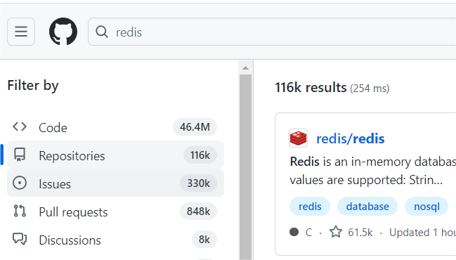

# 项目介绍
> 作者：[Bennie](https://github.com/Bennie61)
* 基于Spring Boot + Vue + Elastic Stack的一站式信息搜索平台，用户可在一个页面集中搜索出不同来源、不同类型的内容，提升搜索体验。当企业中有多个项目的数据需要被搜索时，无需针对每个项目单独开发搜索功能，可以直接将数据接入搜索中台，提升开发效率。
## 技术栈
* Spring Boot 2.7 框架
* SpringBoot-Template 项目模版
* Knife4j 项目的Swagger接口文档和接口测试工具
* MySQL 数据库
* Elastic Stack
  * ElasticSearch 搜索引擎
  * Logstash 数据管道
  * Kibana 数据可视化
* 数据抓取
  * 离线和实时抓取
  * Jsoup 和 HttpClient 库
## 为什么要使用一站式信息搜索或聚合搜索
现有的聚合搜索平台案例：
* [今日热榜](https://tophub.today/) 
* 分析：该页面含有多种不同来源的数据，若为每一种来源都设计一个请求接口，在页面加载时会同时发起多个请求，会导致请求阻塞、页面卡顿。此外，浏览器还存在着资源请求并发数的限制。
查看该网站的后台请求，发现页面仅向后台发送一个统一的请求，用一个接口请求完所有来源的数据。
* GitHub 搜索框
* 业务场景：一个搜索框同时查询多种类型的数据，默认展示某一tab的数据列表，此外同时也要查询其他类型的信息，比如其他类型数据的总数，反馈给用户。

* 一种实现方式：在用户点击某个左侧 tab 的时候，只调用这个 tab 的接口。（https://www.code-nav.cn/search/resource?searchText=java）
* 该方式无法实现上述业务场景，且存在问题：
1）请求不同接口的参数可能不一致，增加前后端沟通成本；
2）前端页面编写调用多个接口的代码，代码存在冗余重复。

**聚合搜索利用统一的接口，通过不同的参数去区分查询的数据源，从而实现一站式集中搜索。**